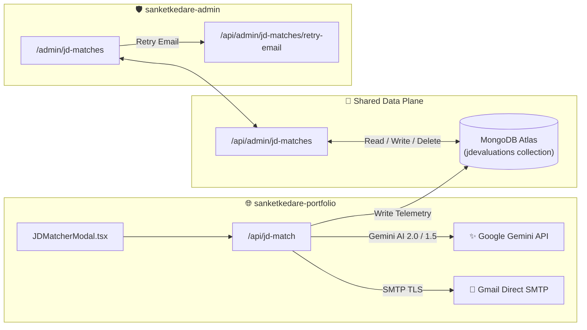

# AI Job Description (JD) Matcher Skill & Architectural Guide

This skill governs the end-to-end development, debugging, testing, and maintenance of the **AI Job Description (JD) Matcher** across the shared production data plane between `sanketkedare-portfolio` and `sanketkedare-admin`.

---

## 🗺️ System Topology & Shared Data Plane



---

## 📁 Key File Locations

### 1. Public Portfolio (`sanketkedare-portfolio`)
* **Modal UI Component**: [`src/components/Resume/JDMatcherModal.tsx`](file:///D:/Sanket/Developer_2.0/Portfolio/sanketkedare-portfolio/src/components/Resume/JDMatcherModal.tsx)
  * Handles Firebase 1-click Google authentication, location detection, text pasting / file upload (`.pdf`, `.docx`, `.txt`), and rendered candidate fit results.
* **Evaluation API**: [`src/app/api/jd-match/route.ts`](file:///D:/Sanket/Developer_2.0/Portfolio/sanketkedare-portfolio/src/app/api/jd-match/route.ts)
  * Server-side URL scraper (`fetchAndExtractUrlContent`) that automatically fetches and extracts web page content when a job link URL (e.g. `https://linkedin.com/jobs/...`, `https://company.com/careers`) is pasted into the input field.
  * Smart Metadata Extraction Engine (`extractSmartMetadata`) that extracts exact Hiring Company Name, Office Location, and Job Title from explicit text patterns, email domains (`recruiter@company.com`), URL domains (`careers.company.com`), and document filenames, overriding generic placeholders (`Target Enterprise`, `Hiring Organization`).
  * Multi-model Gemini fallback sequence (`gemini-2.0-flash`, `gemini-1.5-flash-latest`, `gemini-1.5-flash`, `gemini-2.5-flash`).
  * Structured JSON output with candidate fit score (`0-100%`), verdict, key matched stack, missing skills, tailored pitch, and recommended portfolio projects.
  * Offline heuristic keyword analysis fallback engine.
* **Email Engine**: [`src/lib/send-gmail.ts`](file:///D:/Sanket/Developer_2.0/Portfolio/sanketkedare-portfolio/src/lib/send-gmail.ts)
  * Sends automated thank-you email reports to recruiters via TLS SMTP with inline `cid:portfolio_logo` PNG attachment.
* **Database Schema**: [`src/lib/mongodb.ts`](file:///D:/Sanket/Developer_2.0/Portfolio/sanketkedare-portfolio/src/lib/mongodb.ts)
  * Defines the `JDEvaluation` Mongoose model for the `jdevaluations` collection.

### 2. Executive Admin Console (`sanketkedare-admin`)
* **Telemetry Dashboard**: [`src/app/admin/jd-matches/page.tsx`](file:///D:/Sanket/Developer_2.0/Portfolio/sanketkedare-admin/src/app/admin/jd-matches/page.tsx)
  * Executive data table with qualitative score filters (`>80% Perfect`, `65-80% Matched`, `50-65% Slight`, `<50% Unmatched`).
  * Dedicated **Uploaded Assets Vault** tab to browse & download attached PDF/DOCX files.
  * Dedicated **Pasted Texts & Links Vault** tab to browse, preview, and copy all raw text and job URL submissions.
  * Modal inspector for AI assessment reports, sent email text, and raw JD text.
  * CSV telemetry exporter, demo record seeding, and database purging tools.
* **Admin APIs**: [`src/app/api/admin/jd-matches/route.ts`](file:///D:/Sanket/Developer_2.0/Portfolio/sanketkedare-admin/src/app/api/admin/jd-matches/route.ts)
  * Authenticated GET, POST (seed sample), and DELETE endpoints.
* **Email Retry API**: [`src/app/api/admin/jd-matches/retry-email/route.ts`](file:///D:/Sanket/Developer_2.0/Portfolio/sanketkedare-admin/src/app/api/admin/jd-matches/retry-email/route.ts)
  * Resends thank-you emails for failed deliveries directly from the admin console.

---

## 🎯 Scoring & Evaluation Criteria

| Fit Level | Score Range | Description |
| :--- | :--- | :--- |
| **Domain Mismatch** | `0% - 25%` | Non-software roles (HR, Sales, Recruiter, Medical, Legal, Accounting). |
| **Indirect / Tech-Adjacent** | `26% - 55%` | Different engineering disciplines (Embedded C++, Data Science, Manual QA). |
| **Moderate Alignment** | `56% - 79%` | General Software Engineer / Backend where core stack differs. |
| **Exceptional Alignment** | `80% - 100%` | Full Stack, React 19, Next.js 16, Node.js, TypeScript, GenAI Developer. |

---

## 🛠️ Verification & Testing Runbook

### 1. Test Portfolio API & AI Evaluation
When modifying prompt instructions or Gemini evaluation logic:
```bash
# Test POST request payload structure against local dev server
curl -X POST http://localhost:3000/api/jd-match \
  -H "Content-Type: application/json" \
  -d '{
    "jdText": "Looking for a Senior React & Next.js Full Stack Engineer with TypeScript and Node.js experience.",
    "recruiterEmail": "testrecruiter@example.com",
    "recruiterName": "Jane Doe",
    "recruiterLocation": "San Francisco, CA"
  }'
```

### 2. Verify Database Persistence in MongoDB Atlas
Ensure new evaluations write to `jdevaluations` collection:
```typescript
import { dbConnect, JDEvaluation } from '@/lib/mongodb';
await dbConnect();
const latestEval = await JDEvaluation.findOne({}).sort({ createdAt: -1 });
console.log('Latest JD Evaluation Record:', latestEval);
```

### 3. Verify Admin Console Sync & Asset Downloads
- Navigate to `http://localhost:3001/admin/jd-matches`.
- Click **"Seed Record"** to verify sample record creation.
- Check pagination, score filters, email text rendering, and CSV download capability.

---

## ⚠️ Key Engineering Rules & Gotchas

1. **Mandatory Firebase Auth Gate**: Do not remove the `!user` check in `JDMatcherModal.tsx`. Recruiter email authentication is required to prevent unauthenticated bot spamming of Gemini API tokens.
2. **Obsidian Dark Theme Integrity**: In `sanketkedare-admin`, strictly maintain the `#090d16` background and high-contrast slate typography.
3. **No Max-Width Containers**: The admin telemetry page must span `w-full` (100% viewport width) without `max-w-7xl` boundaries.
4. **Offline Resilience**: Always maintain the heuristic fallback logic in `route.ts` so the portfolio remains fully functional if Gemini API rate limits occur.
