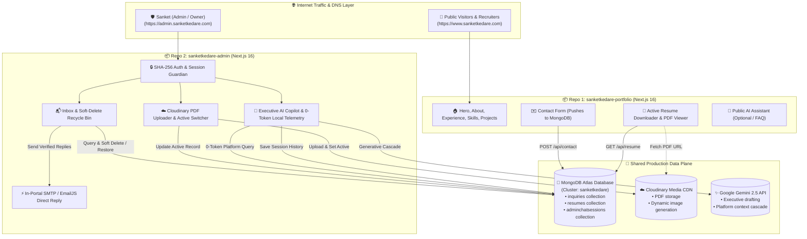

# 🏛️ Multi-Project Architecture & Repository Separation Plan
### `www.sanketkedare.com` (Public Portfolio) ⟷ `admin.sanketkedare.com` (Admin Portal)

> **Document Status**: Complete Implementation & Separation Blueprint  
> **Target Deployments**:  
> - **Public Portfolio**: `https://www.sanketkedare.com` (Primary Apex Domain)  
> - **Admin Portal**: `https://admin.sanketkedare.com` (Dedicated Admin Subdomain)  
> **Core Guarantee**: **Zero code loss, zero feature loss, zero database disconnect**.

---

## 1. 🌐 System Topology & Data Plane Architecture

Both applications are deployed as standalone Next.js projects on Vercel, sharing the same live MongoDB Atlas cluster, Cloudinary CDN, and Gemini AI engine.



---

## 2. 📦 Project 1: Public Portfolio (`sanketkedare-portfolio`)

### 🎯 Scope & Responsibilities
- Ultra-fast static generation, SEO optimization, and rich visual interactive animations (Framer Motion, Canvas, Tailwind v4).
- Serves the public website at `www.sanketkedare.com`.
- Captures recruiter & client inquiries and inserts them directly into MongoDB.
- Reads and serves the currently active resume PDF URL without hardcoded links.

### 📁 File Tree Layout
```
sanketkedare-portfolio/
├── public/
│   ├── favicon.ico
│   ├── manifest.json
│   └── robots.txt
├── src/
│   ├── app/
│   │   ├── api/
│   │   │   ├── contact/
│   │   │   │   └── route.ts            # POST: Validates & saves inquiry to MongoDB + Email alert
│   │   │   ├── resume/
│   │   │   │   └── route.ts            # GET: Returns current active resume link from MongoDB
│   │   │   └── chat/
│   │   │       └── route.ts            # POST: Public AI FAQ chatbot (optional)
│   │   ├── offline/
│   │   │   └── page.tsx                # PWA offline fallback
│   │   ├── layout.tsx                  # Global HTML, Fonts, Analytics, Navbar, Footer
│   │   ├── page.tsx                    # Main single-page portfolio sections
│   │   ├── globals.css                 # Tailwind v4 & Cambria font styling
│   │   ├── not-found.tsx               # 404 page
│   │   ├── opengraph-image.tsx         # Dynamic OG image
│   │   ├── twitter-image.tsx           # Dynamic Twitter card
│   │   └── sitemap.ts                  # Dynamic SEO sitemap
│   ├── components/
│   │   ├── Navbar/                     # Navigation header
│   │   ├── Sidebar/                    # Mobile slide-out navigation
│   │   ├── Home/                       # Hero section with animated introduction
│   │   ├── About/                      # Bio, journey & philosophy
│   │   ├── Experience/                 # Work history timeline & highlights
│   │   ├── Skills/                     # Skill cards & continuous marquee
│   │   ├── Projects/                   # Flagship projects showcase
│   │   ├── Resume/                     # Resume preview modal & dynamic download button
│   │   ├── Contact/                    # Client-side contact submission form
│   │   ├── Footer/                     # Footer & copyright
│   │   ├── Parallax/                   # Visual background effects
│   │   ├── Pwa/                        # Install prompt & service worker
│   │   └── Toaster/                    # Toast notification manager
│   ├── lib/
│   │   ├── mongodb.ts                  # MongoDB connection & Inquiry + Resume schemas
│   │   ├── personal-info.ts            # Static data (skills, bio, projects)
│   │   └── toast.ts                    # Toast trigger helpers
│   └── styles/
│       └── index.css                   # Font definitions & CSS utilities
├── next.config.ts
├── package.json
├── tsconfig.json
└── .env.local
```

### 🔑 Environment Variables (`.env.local`)
```env
# MongoDB Atlas (Same connection string as Admin)
MONGODB_URI=mongodb+srv://<username>:<password>@cluster.mongodb.net/sanketkedare?retryWrites=true&w=majority

# Base Canonical URL
NEXT_PUBLIC_APP_URL=https://www.sanketkedare.com

# EmailJS (For public contact form notifications)
NEXT_PUBLIC_EMAILJS_SERVICE_ID=service_xxxxx
NEXT_PUBLIC_EMAILJS_TEMPLATE_ID=template_xxxxx
NEXT_PUBLIC_EMAILJS_PUBLIC_KEY=user_xxxxx

# Gemini API (For public chatbot)
GEMINI_API_KEY=AIzaSy...
```

---

## 3. 🛡️ Project 2: Executive Admin Portal (`sanketkedare-admin`)

### 🎯 Scope & Responsibilities
- Dedicated private management console at `admin.sanketkedare.com`.
- **Zero public footprint**: Direct root access to `/inbox`, `/resumes`, and `/chat`.
- Manages all contact inquiries with read/unread flags, reply drafts, and soft-delete Recycle Bin.
- Uploads PDFs to Cloudinary and sets the active resume instantaneously across the portfolio.
- Embedded Executive AI Copilot with multi-session memory and 0-token platform telemetry.

### 📁 File Tree Layout
```
sanketkedare-admin/
├── public/
│   └── favicon.ico
├── src/
│   ├── app/
│   │   ├── (dashboard)/
│   │   │   ├── inbox/
│   │   │   │   └── page.tsx            # Inbox, search, unread tracking, reply composer, Recycle Bin
│   │   │   ├── resume/
│   │   │   │   └── page.tsx            # Resume PDF uploader, rename, version list, inline preview
│   │   │   ├── chat/
│   │   │   │   └── page.tsx            # Full-width AI Copilot, session sidebar, local queries
│   │   │   └── page.tsx                # Root redirect -> /inbox
│   │   ├── api/
│   │   │   ├── auth/
│   │   │   │   └── route.ts            # Admin password validation & cookie issuance
│   │   │   ├── health/
│   │   │   │   └── route.ts            # MongoDB connection latency & health telemetry
│   │   │   ├── inquiries/
│   │   │   │   └── route.ts            # GET active/recycle list, PATCH read/restore/soft_delete
│   │   │   ├── reply/
│   │   │   │   └── route.ts            # POST: In-portal SMTP email reply dispatcher
│   │   │   ├── resume/
│   │   │   │   └── route.ts            # POST: Upload PDF to Cloudinary & insert into MongoDB
│   │   │   ├── resumes/
│   │   │   │   ├── route.ts            # GET: All resume versions
│   │   │   │   └── [id]/
│   │   │   │       └── route.ts        # PATCH (set active), PUT (rename), DELETE (permanent delete)
│   │   │   └── chat/
│   │   │       ├── route.ts            # POST: Local-first router + Gemini multi-model cascade
│   │   │       └── sessions/
│   │   │           └── route.ts        # GET, POST, DELETE chat sessions in MongoDB
│   │   ├── layout.tsx                  # Root shell with Obsidian & Royal Indigo theme
│   │   ├── globals.css                 # Tailwind v4 dark theme styling
│   │   └── not-found.tsx               # Admin 404 handler
│   ├── components/
│   │   ├── Admin/
│   │   │   ├── AdminShell.tsx          # Collapsible navigation, mobile header, DB health pill
│   │   │   └── MarkdownRenderer.tsx    # Native Markdown parser, syntax highlighter, copy button
│   │   └── Toaster/
│   │       ├── Toaster.tsx             # Notification and confirmation modals
│   │       └── ToastContainer.tsx      # Toast mount provider
│   ├── lib/
│   │   ├── mongodb.ts                  # Shared Mongoose models (Inquiry, Resume, AdminChatSession)
│   │   ├── admin-auth.ts               # SHA-256 portal credential verification & storage
│   │   ├── admin-ai-router.ts          # Deterministic local query engine (0 LLM tokens)
│   │   ├── gemini.ts                   # Gemini multi-model cascade with live DB context
│   │   ├── send-gmail.ts               # Direct SMTP mailer for verified replies
│   │   ├── personal-info.ts            # Admin metadata & contact details
│   │   └── toast.ts                    # Admin toast notifications
│   └── styles/
│       └── index.css                   # Global font definitions
├── next.config.ts
├── package.json
├── tsconfig.json
└── .env.local
```

### 🔑 Environment Variables (`.env.local`)
```env
# Admin Portal Password
ADMIN_PASSWORD=your_secure_password_here

# MongoDB Atlas (Exact same cluster URI as Portfolio)
MONGODB_URI=mongodb+srv://<username>:<password>@cluster.mongodb.net/sanketkedare?retryWrites=true&w=majority

# Cloudinary (For PDF resume storage)
CLOUDINARY_CLOUD_NAME=your_cloud_name
CLOUDINARY_API_KEY=your_api_key
CLOUDINARY_API_SECRET=your_api_secret

# Google Gemini API (For Admin Copilot & AI Drafts)
GEMINI_API_KEY=AIzaSy...

# Gmail SMTP / Email Dispatch (For In-Portal Replies)
GMAIL_USER=sanketkedare200@gmail.com
GMAIL_APP_PASSWORD=your_16_digit_app_password

# Public Portfolio Reference URL
NEXT_PUBLIC_PORTFOLIO_URL=https://www.sanketkedare.com
```

---

## 4. 🔄 How the Two Projects Connect Seamlessly (Zero Loss)

| Workflow | Initiated On | Execution Details | Result Visible On |
|---|---|---|---|
| **Contact Form Submission** | `www.sanketkedare.com` | Visitor fills form -> `POST /api/contact` -> Inserts `{ name, email, message, read: false, deleted: false }` into MongoDB Atlas. | Appears instantaneously in `admin.sanketkedare.com/inbox` with unread notification badge. |
| **Email Status & Reply** | `admin.sanketkedare.com` | Admin clicks "AI Draft" or "Send Reply" -> Dispatches verified reply via SMTP/EmailJS -> Marks `read: true, replied: true`. | Message archived, sender receives direct response, audit trail saved in MongoDB. |
| **Soft Delete & Restore** | `admin.sanketkedare.com` | Admin moves message to Recycle Bin -> Flags `deleted: true`. Admin can restore at any time. | Safely hidden from active inbox; zero data permanently lost. |
| **Resume Upload & Versioning** | `admin.sanketkedare.com` | Admin uploads `Sanket_Kedare_Resume.pdf` -> Uploaded to Cloudinary -> Stored in MongoDB -> Marked `isActive: true` (previous active becomes inactive). | Instant download of the new PDF when visitors click "Download Resume" on `www.sanketkedare.com`. |
| **Executive AI Copilot** | `admin.sanketkedare.com` | Admin asks platform questions -> Local Router checks MongoDB directly in `<5ms` (`0 tokens`) -> Multi-turn history saved in MongoDB. | Persistent conversation history across browser reloads and devices. |

---

## 5. 🛠️ Step-by-Step Repository Separation Playbook

### Step 1: Create Two Clean Repositories on GitHub
1. Create `sanketkedare-portfolio` on GitHub.
2. Create `sanketkedare-admin` on GitHub.

---

### Step 2: Initialize & Populate `sanketkedare-portfolio`
```bash
# Clone the current unified project into a new folder
git clone https://github.com/sanketkedare/sanketkedare.git sanketkedare-portfolio
cd sanketkedare-portfolio

# Remove admin-specific pages and endpoints
rm -rf src/app/admin
rm -rf src/app/api/admin
rm -rf src/components/Admin
rm -f src/lib/admin-ai-router.ts
rm -f src/lib/admin-auth.ts
rm -f src/lib/send-gmail.ts

# Commit and point to the new portfolio repository
git remote set-url origin https://github.com/sanketkedare/sanketkedare-portfolio.git
git add -A
git commit -m "✨ feat: initialize dedicated public portfolio repository 🚀"
git push -u origin master
```

---

### Step 3: Initialize & Populate `sanketkedare-admin`
```bash
# Clone the unified project into an admin folder
git clone https://github.com/sanketkedare/sanketkedare.git sanketkedare-admin
cd sanketkedare-admin

# Clean up public portfolio presentation sections (Home, About, Skills, Projects, Experience)
rm -rf src/components/Home
rm -rf src/components/About
rm -rf src/components/Experience
rm -rf src/components/Skills
rm -rf src/components/Projects
rm -rf src/components/Resume
rm -rf src/components/Contact
rm -rf src/components/Footer
rm -rf src/components/Navbar
rm -rf src/components/Sidebar
rm -rf src/components/Parallax
rm -rf src/app/api/contact
rm -rf src/app/api/resume
rm -rf src/app/api/chat

# Update root routing: Move /admin/* to clean top-level routes (/inbox, /resume, /chat)
# In app/page.tsx -> redirect('/inbox')

# Commit and point to the new admin repository
git remote set-url origin https://github.com/sanketkedare/sanketkedare-admin.git
git add -A
git commit -m "✨ feat: initialize dedicated admin portal repository 🚀"
git push -u origin master
```

---

### Step 4: Configure Vercel Projects & Domains

#### 1. Public Portfolio Deployment:
- Import `sanketkedare-portfolio` into Vercel.
- **Settings → Domains**:
  - Add `www.sanketkedare.com` (Primary)
  - Add `sanketkedare.com` (Redirects to `www.sanketkedare.com`)
- **Settings → Environment Variables**: Add `MONGODB_URI`, `NEXT_PUBLIC_APP_URL`, `NEXT_PUBLIC_EMAILJS_*`, `GEMINI_API_KEY`.

#### 2. Admin Portal Deployment:
- Import `sanketkedare-admin` as a **separate project** in Vercel.
- **Settings → Domains**:
  - Add `admin.sanketkedare.com`
- **Settings → Environment Variables**: Add `ADMIN_PASSWORD`, `MONGODB_URI`, `CLOUDINARY_*`, `GEMINI_API_KEY`, `GMAIL_*`.

---

### Step 5: DNS Configuration (Cloudflare / GoDaddy / Namecheap)
In your DNS provider dashboard, add the following DNS records:

| Record Type | Host / Name | Value / Destination | Purpose |
|---|---|---|---|
| **A** | `@` (or `sanketkedare.com`) | `76.76.21.21` (Vercel IP) | Apex domain routing |
| **CNAME** | `www` | `cname.vercel-dns.com` | Public Portfolio (`www.sanketkedare.com`) |
| **CNAME** | `admin` | `cname.vercel-dns.com` | Admin Portal (`admin.sanketkedare.com`) |

---

## 6. ✅ Pre-Flight Verification Checklist

Before decommissioning the legacy monolithic setup, verify the following:

- [ ] **Contact Form Test**: Submit test message on `www.sanketkedare.com/contact` → Check that it displays immediately on `admin.sanketkedare.com/inbox`.
- [ ] **In-Portal Reply Test**: Send a response from `admin.sanketkedare.com/inbox` → Verify email is delivered to the sender's inbox.
- [ ] **Resume Update Test**: Upload a new PDF on `admin.sanketkedare.com/resume` → Click "Download Resume" on `www.sanketkedare.com` and confirm the new PDF opens.
- [ ] **AI Copilot Memory Test**: Start a conversation in `admin.sanketkedare.com/chat` → Refresh the browser and verify previous history is restored from MongoDB.
- [ ] **Security Test**: Try visiting `admin.sanketkedare.com` in an incognito window → Ensure the password gate triggers before any dashboard data is exposed.

---

### 🏆 Summary
With this separation:
1. **Public Portfolio** is lightweight, loads in `<0.5s`, has zero administrative overhead, and maximizes SEO.
2. **Admin Portal** is fully isolated on `admin.sanketkedare.com`, completely private, secured by backend authentication, and equipped with full AI & telemetry power.
3. **MongoDB Atlas** remains the single source of truth connecting both apps seamlessly with **0% data loss**.
