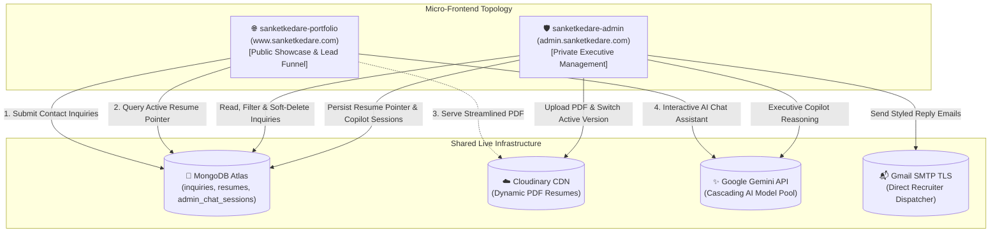

<p align="center">
  
</p>

<div align="center">

[](https://www.sanketkedare.com)
[](https://admin.sanketkedare.com)
[-black?style=for-the-badge&logo=next.js&logoColor=white)](https://nextjs.org/)
[](https://react.dev/)
[](https://www.typescriptlang.org/)
[](https://www.mongodb.com/atlas)

</div>

<div align="center">
  
</div>

<p align="center">
  
  
  
</p>

---

## 🌟 About Sanket Kedare

I am a **Full Stack Developer** specializing in **GenAI, System Design, and Scalable Web Architecture**. I build resilient, high-performance web platforms and intelligent AI-driven systems engineered for speed, clean code, and intuitive user experiences.

* 🚀 **Core Focus**: Full Stack Web Development, Generative AI integration, and Distributed System Design.
* ⚡ **Performance & DX**: Sub-second First Contentful Paint (FCP), 95+ Core Web Vitals, and strict TypeScript types.
* 🌐 **Canonical Domain**: [https://www.sanketkedare.com](https://www.sanketkedare.com) (Enforced via 308 permanent redirect & edge middleware).

---

## 🏛️ Ecosystem & Micro-Frontend Topology

The portfolio ecosystem is separated into two decoupled, high-security repositories sharing a centralized MongoDB Atlas data plane:



* **Main Public Portfolio** ([sanketkedare-portfolio](https://github.com/sanketkedare/sanketkedare-portfolio)): Public showcase, interactive career timeline, enterprise deliverables, live AI chat widget, and dynamic PDF resume viewer.
* **Dedicated Executive Admin** ([sanketkedare-admin](https://github.com/sanketkedare/sanketkedare-admin)): Private command console with master SHA-256 zero-trust security gate, real-time inquiry inbox, in-portal Gmail SMTP dispatcher, Cloudinary PDF version switcher, and AI copilot.

---

## 🛠️ Tech Arsenal

<div align="center">
  
</div>

| Layer | Technologies |
| :--- | :--- |
| **Framework & UI** | Next.js 16.2 (Turbopack, App Router), React 19.1, Tailwind CSS v4, Framer Motion 12 |
| **Language & Typing** | TypeScript 5.8 (Strict Mode), ESNext, Node.js 22+ |
| **Database & Cache** | MongoDB Atlas, Mongoose 8.12, In-Memory Telemetry Cache |
| **AI & LLM Services** | Google Gemini API (2.5 Cascade), Hybrid Local 0-Token Intent Engine |
| **Media & Delivery** | Cloudinary CDN, Sharp Image Processing, Vercel Edge Network |
| **SEO & Telemetry** | Schema.org Person JSON-LD, OpenGraph 1200x630, Vercel Analytics, Canonical Edge Redirects |

---

## 📌 Featured Projects & Enterprise Deliverables

<table>
  <tr>
    <td width="50%">
      <h3>📈 CryptoDash Pro</h3>
      <p>Institutional crypto intelligence terminal with Gemini AI & LTTB downsampling (60 FPS).</p>
      <a href="https://www.cyptodashpro.sanketkedare.com/">🌐 Live Terminal</a> &bull; <a href="https://github.com/sanketkedare/CryptoDash-Pro">🔗 GitHub</a>
    </td>
    <td width="50%">
      <h3>⚒️ ReactForge</h3>
      <p>Frontend engineering lab with 100 React challenges, telemetry HUD & incident simulator.</p>
      <a href="https://www.reactforge.sanketkedare.com/">🌐 Live Studio</a> &bull; <a href="https://github.com/sanketkedare/ReactForge">🔗 GitHub</a>
    </td>
  </tr>
  <tr>
    <td width="50%">
      <h3>🏢 VisionTech Group Ecosystem</h3>
      <p>Commercial web platforms, LMS video engines, and enterprise operations tooling.</p>
      <a href="https://www.sanketkedare.com/#projects">🌐 View Case Studies</a>
    </td>
    <td width="50%">
      <h3>🌋 Volcanic</h3>
      <p>Enterprise AI & scalable cloud software engineering platform.</p>
      <a href="https://www.volcanic.world/">🌐 Live Platform</a>
    </td>
  </tr>
</table>

---

## 🚀 Local Development Setup

```bash
# 1. Clone the repository
git clone https://github.com/sanketkedare/sanketkedare-portfolio.git
cd sanketkedare-portfolio

# 2. Install dependencies
npm install

# 3. Create .env.local file
cp .env.example .env.local

# 4. Start Turbopack local development server on port 3010
npm run dev

# 5. Open in browser
# http://localhost:3010
```

---

## 🛠️ Available Scripts

| Command | Description |
| :--- | :--- |
| `npm run dev` | Starts Next.js Turbopack dev server on port `3010` |
| `npm run build` | Builds the production bundle |
| `npm run start` | Runs the production server on port `3010` |
| `npm run type-check` | Validates TypeScript types (`tsc --noEmit`) |
| `npm run lint` | Runs Next.js ESLint analyzer |

---

## 🤝 Let's Connect

* 🌐 **Live Website**: [www.sanketkedare.com](https://www.sanketkedare.com)
* 💼 **LinkedIn**: [linkedin.com/in/sanket-kedare-dev](https://www.linkedin.com/in/sanket-kedare-dev)
* 🐙 **GitHub**: [github.com/sanketkedare](https://github.com/sanketkedare)
* 📧 **Email**: [sanketkedare200@gmail.com](mailto:sanketkedare200@gmail.com)
* 📍 **Location**: Hyderabad, India (Open to Remote Worldwide & Relocation)

---

<p align="center">
  
</p>
