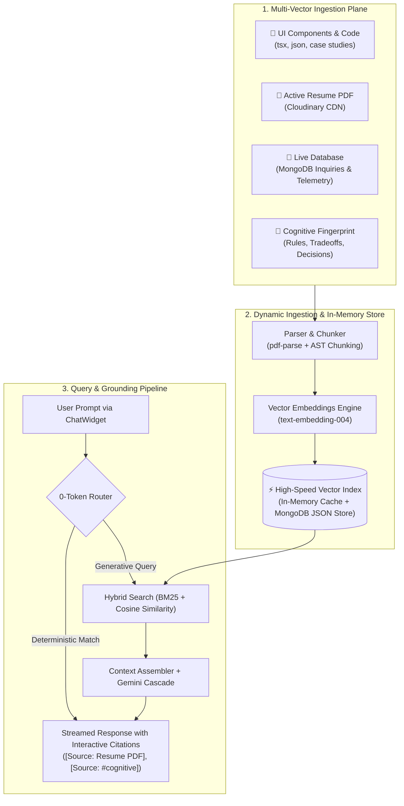

# 🧠 Portfolio RAG+: Dynamic Omniscient Context Engine
> **Target Project**: `sanketkedare-portfolio` & `sanketkedare-admin`  
> **Prepared For**: Next Development Phase  
> **Author**: Sanket Kedare & Antigravity Intelligence  
> **Status**: Ready for Implementation  

---

## 🎯 Executive Summary & Architectural Vision

**Portfolio RAG+** upgrades the portfolio's conversational AI assistant into an omniscient, self-updating, grounded retrieval engine. Instead of answering only from static system instructions or suffering from hallucination, RAG+ bridges all four live data planes of the ecosystem:

---

## 📂 The 4 Multi-Modal Ingestion Vectors

### Vector A: Live Codebase & UI Component Manifest
- **Source**: `src/components/**`, `ProjectList.json`, `Skills.tsx`, and case studies.
- **Extraction Strategy**:
  - Automatically crawls project definitions, engineering implementations, architecture diagrams, and technology chips.
  - Extracts code snippets illustrating specific design patterns (e.g. TanStack Virtual 10,000-row virtualization, LTTB geometric downsampling, throttled WebSockets).
- **Update Frequency**: Refreshes at build time or hot-reloads during local dev.

### Vector B: Active PDF Resume (Cloudinary CDN)
- **Source**: `Resume.findOne({ isActive: true })` in MongoDB Atlas -> Cloudinary PDF URL.
- **Extraction Strategy**:
  - Uses `pdf-parse` (or Cloudinary text extraction) to pull the full raw text, section boundaries, dates, and bullet points.
  - Chunks content by section: `Resume: Work History`, `Resume: Education`, `Resume: Certifications`, `Resume: Core Competencies`.
- **Invalidation Trigger**: Whenever an admin uploads a new resume or changes the active status in `/admin/resume`, the system triggers an automatic re-parse and invalidates the cache.

### Vector C: Live Database Telemetry (MongoDB Atlas)
- **Source**: `inquiries`, `resumes`, `adminchatsessions` collections.
- **Extraction Strategy**:
  - Direct live aggregation of platform stats (e.g. total inquiries received, active resume version, recent updates, system uptime).
  - Answers deterministic operational questions at `<5ms` and **0 LLM tokens**.

### Vector D: Cognitive Fingerprint & Engineering Rules
- **Source**: `utils/cognetive_fingerprint.json`.
- **Extraction Strategy**:
  - Chunks each tradeoff axis (`Resolution Depth 95%`, `Data Contracts 92%`, `Modularity 92%`, `Optimization Strategy 87%`).
  - Indexes all engineering rules (`RULE_01` to `RULE_04`) and postmortem decision logs (`DEC_INFRA_01`, `DEC_CONTRACT_03`, `DEC_AGENT_02`).

---

## ⚡ High-Speed Retrieval & Grounding Architecture

### 1. Zero-Token Deterministic Filter (Layer 0)
- Prompts matching exact platform queries (e.g., *"What is your tech stack?"*, *"Where can I download your resume?"*, *"Check database status"*) are intercepted by the local query router.
- **Latency**: `<5ms`
- **Cost**: **0 tokens**

### 2. Hybrid Semantic Retrieval (Layer 1)
- Combines:
  1. **BM25 Keyword Matching**: Captures exact technical keywords (e.g., *"LTTB"*, *"Docker"*, *"WebSockets"*, *"RULE_02"*).
  2. **Dense Vector Similarity**: Uses Google `text-embedding-004` (768 dimensions) to find semantically relevant paragraphs.
- Reranks top-3 highest-confidence chunks to assemble the injection prompt.

### 3. Interactive UI Citations (Layer 2)
When the assistant generates an answer, citations are formatted as interactive chips:
- `[Source: Active Resume (p.1)]` -> Clicking opens the PDF modal or jumps to `#resume`.
- `[Source: Cognitive Rule 01]` -> Clicking smooth-scrolls to `#cognitive`.
- `[Source: CryptoDash Case Study]` -> Clicking opens the live project case study.

---

## 🛠️ Step-by-Step Implementation Plan for Tomorrow

### Phase 1: Server-Side PDF & File Chunker
- Install `pdf-parse` in `sanketkedare-portfolio`.
- Create `src/lib/rag/pdf-loader.ts` to fetch and parse the active Cloudinary resume buffer.
- Create `src/lib/rag/code-scanner.ts` to parse `ProjectList.json`, `Skills.tsx`, and `cognetive_fingerprint.json` into semantic chunks.

### Phase 2: Embedding Engine & Cache Layer
- Create `src/lib/rag/embeddings.ts` using Gemini `text-embedding-004`.
- Create `src/lib/rag/vector-store.ts` for fast in-memory cosine similarity search with MongoDB persistence.
- Add cache invalidation endpoint (`/api/rag/reindex`) called by the admin console when a resume is updated.

### Phase 3: Query Pipeline & Grounding Integration
- Update `src/app/api/chat/route.ts` to query the vector store for top-K matching chunks.
- Format context with strict provenance: `--- RETRIEVED CONTEXT ---`.
- Ground Gemini responses with zero hallucination.

### Phase 4: UI Citation Chips in ChatWidget
- Update `src/components/Chat/ChatWidget.tsx` markdown parser to render `[Source: ...]` tags as glowing clickable interactive pills.
- Add deep-link navigation handlers (e.g. jump to `#cognitive`, `#skills`, `#resume`, or open project links).

---

## 🔒 Security, Token Efficiency & Cost Controls
1. **Free-Tier Compatibility**: `text-embedding-004` operates within Google's free-tier limits.
2. **In-Memory Caching**: Embeddings are computed only once upon code change or resume upload, not on every user chat message.
3. **Strict Guardrails**: Guardrail prompt prevents prompt injection, jailbreaking, or answering questions unrelated to Sanket's portfolio.

# Suggestion
- use mongo db for catching 
- update mongo data of catching regulerly. 